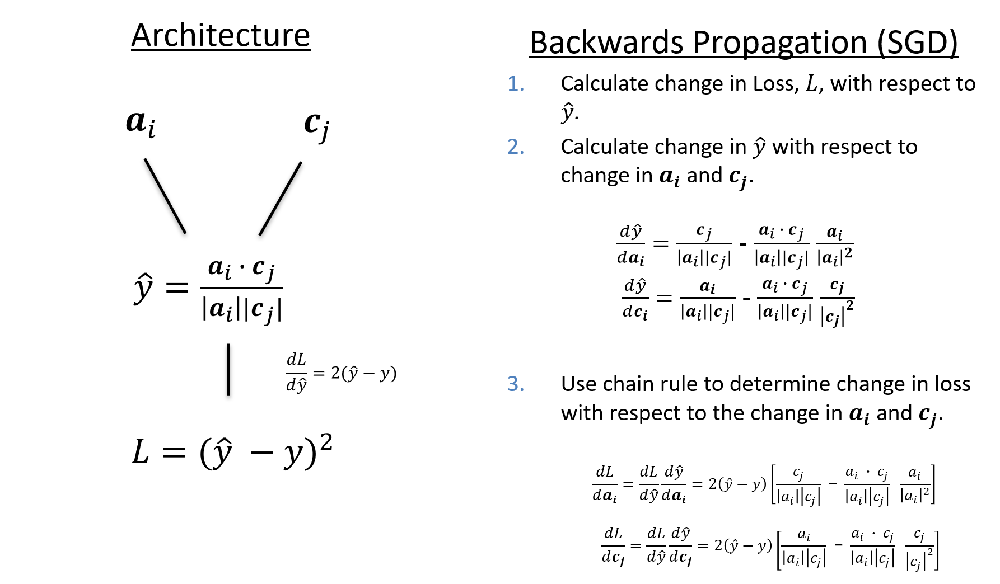

Defines the Cosine Loss Function.

The backwards pass for the cosine loss function is computed as follows:



______

## **Cosine**`#!py3 class` { #Cosine data-toc-label=Cosine }


**class functions & static methods:** 

 - [`__init__`](#__init__)
 - [`activation_exp`](#activation_exp)
 - [`activation_none`](#activation_none)
 - [`activation_sigmoid`](#activation_sigmoid)
 - [`activation_tanh`](#activation_tanh)
 - [`compute`](#compute)
 - [`compute_y_true`](#compute_y_true)

### *Cosine*.**__init__**`#!py3 (self, activation='exp')` { #__init__ data-toc-label=__init__ }

Initialises the Cosine Loss Function class.


??? info "Source Code" 
	```py3 linenums="1 1 2" 
	def __init__(self, activation='exp'):
	    
	    super().__init__(activation)
	
	```

______

### *Cosine*.**activation_exp**`#!py3 (self, z)` { #activation_exp data-toc-label=activation_exp }


??? info "Source Code" 
	```py3 linenums="1 1 2" 
	def activation_exp(self, z):
	
	    diag = xp.identity(z.shape[-1])
	    off_diag = xp.subtract(xp.ones_like(diag), diag)
	
	    y_pred = xp.exp(z) * diag + xp.exp(-z) * off_diag
	
	    # Get the true matrix.
	    y_true = self.compute_y_true(y_pred, lims=(xp.exp(1), xp.exp(1)))
	
	    # calculate the difference between y_true and y_pred matrices.
	    loss = xp.subtract(y_true, y_pred)
	
	    dy_dz = y_pred * diag - y_pred * off_diag
	
	    dL_dz = xp.multiply(loss, dy_dz)
	
	    return y_pred, y_true, dL_dz
	
	```

______

### *Cosine*.**activation_none**`#!py3 (self, y_pred)` { #activation_none data-toc-label=activation_none }

No activation function.

Computes the difference between the true and predicted matrices.

!!! note "Loss"
    Technically the loss should be the squared difference of the true and prediction matrices; however, in
    practice, the difference alone does not significant change the training performance while removing some
    complexity.

!!! warning "y_true Configuration"
    The configuration for generating the true matrix for the ``activation_none`` function is setup to work with
    the ``cosine`` loss function. Due to the limits of the cosine function [-1, 1], a negative example is set to
     -1 and a positive samples is set to 1.

**Parameters**
> **y_pred:** ``array`` -- The prediction matrix.

**Returns**
> **y_pred:** ``array`` -- The prediction matrix.

> **y_true:** ``array`` -- The true matrix.

> **loss:** ``array`` -- The difference between the true and predicted matrices.


??? info "Source Code" 
	```py3 linenums="1 1 2" 
	def activation_none(self, y_pred):
	    
	
	    # Get the true matrix.
	    y_true = self.compute_y_true(y_pred, lims=(-1, 1))
	
	    # calculate the difference between y_true and y_pred matrices.
	    dL_dy = xp.subtract(y_true, y_pred)
	
	    return y_pred, y_true, dL_dy
	
	```

______

### *Cosine*.**activation_sigmoid**`#!py3 (self, z)` { #activation_sigmoid data-toc-label=activation_sigmoid }

Computes the forward and backward passes of the sigmoid activation function.

**Parameters**
> **z:** ``array`` -- The input to the sigmoid activation function.

**Returns**
> **y_pred:** ``array`` -- The prediction matrix.

> **y_true:** ``array`` -- The true matrix.

> **dL_dz:** ``array`` -- The change in loss with respect to the change in z.

!!! note "Loss"
    Technically the loss should be the squared difference of the true and prediction matrices; however, in
    practice, the difference alone does not significant change the training performance while removing some
    complexity.


??? info "Source Code" 
	```py3 linenums="1 1 2" 
	def activation_sigmoid(self, z):
	    
	
	    # Compute the elementwise sigmoid of the prediction matrix.
	    y_pred = sigmoid(z)
	
	    # Get the true matrix.
	    y_true = self.compute_y_true(y_pred)
	
	    # calculate the difference between y_true and y_pred matrices.
	    loss = xp.subtract(y_true, y_pred)
	
	    # Change in y_pred with respect to z.
	    dy_dz = xp.subtract(y_pred, xp.power(y_pred, 2))
	
	    # Calculate the change in loss with respect to the change in z. (Chain Rule).
	    dL_dz = xp.multiply(loss, dy_dz)
	
	    return y_pred, y_true, dL_dz
	
	```

______

### *Cosine*.**activation_tanh**`#!py3 (self, z)` { #activation_tanh data-toc-label=activation_tanh }

Computes the forward and backward passes of the sigmoid activation function.

**Parameters**
> **z:** ``array`` -- The input to the sigmoid activation function.

**Returns**
> **y_pred:** ``array`` -- The prediction matrix.

> **y_true:** ``array`` -- The true matrix.

> **dL_dz:** ``array`` -- The change in loss with respect to the change in z.

!!! note "Loss"
    Technically the loss should be the squared difference of the true and prediction matrices; however, in
    practice, the difference alone does not significant change the training performance while removing some
    complexity.


??? info "Source Code" 
	```py3 linenums="1 1 2" 
	def activation_tanh(self, z):
	    
	
	    y_pred = xp.tanh(z)
	
	    # Get the true matrix.
	    y_true = self.compute_y_true(y_pred, lims=(-1, 1))
	
	    # calculate the difference between y_true and y_pred matrices.
	    loss = xp.subtract(y_true, y_pred)
	
	    # Change in y_pred with respect to z.
	    dy_dz = xp.ones_like(y_pred) - xp.power(xp.tanh(y_pred), 2)
	
	    # Calculate the change in loss with respect to the change in z. (Chain Rule).
	    dL_dz = xp.multiply(loss, dy_dz)
	
	    return y_pred, y_true, dL_dz
	
	```

______

### *Cosine*.**compute**`#!py3 (self, w_a, w_c)` { #compute data-toc-label=compute }

Computes the change in actor and community weights to optimise cosine loss function.

**Parameters**
> **w_a:** ``array`` -- The actor embeddings to be updated.

> **w_c:** ``array`` -- The community embeddings to be updated.

**Returns**
> **dL_dwa:** ``array`` -- The change in loss function with respect to the change in actor embeddings.

> **dL_dwc:** ``array`` -- The change in loss function with respect to the change in community embeddings.

> **y_true:** ``array`` -- The true matrix.

> **y_ture:** `` array`` -- The prediction matrix.


??? info "Source Code" 
	```py3 linenums="1 1 2" 
	def compute(self, w_a, w_c):
	    
	
	    # Calculate the euclidean norm of the actors and communities
	    norm_a = xp.linalg.norm(w_a, axis=2).reshape(w_a.shape[0], 1, w_a.shape[1])
	    norm_c = xp.linalg.norm(w_c, axis=2).reshape(w_c.shape[0], 1, w_c.shape[1])
	
	    # Multiply every actors' norm with every community norm.
	    norm = xp.matmul(xp.transpose(norm_a, (0, 2, 1)), norm_c)
	
	    # Element wise inverse. Used to divide the actors/communities by every norm.
	    norm_inv = xp.power(norm, -1)
	
	    # Calculate the cosine similarity between every actor/community combination.
	    cosine_sim = xp.divide(xp.matmul(w_a, xp.transpose(w_c, (0, 2, 1))), norm)
	
	    # Pass the cosine sim through activation function. (forward & backward pass).
	    y_pred, y_true, dL_dy = self.activation(cosine_sim)
	
	    # Multiple norm_inv and cosine_sim by the
	    norm_inv = xp.multiply(norm_inv, dL_dy)
	    cosine_sim = xp.multiply(cosine_sim, dL_dy)
	
	    # - Actors Update -------------------------------------------------------------------------------------------- #
	
	    # Divide the communities by their respective norm.
	    d_wa_2 = xp.matmul(norm_inv, w_c)
	
	    # Divide each actor by its l2 squared norm.
	    d_wa_3 = xp.divide(w_a, xp.power(xp.transpose(norm_a, (0, 2, 1)), 2))  # Dim [2, 2]
	
	    # Sum the cosine coefficient over the community set
	    d_wa_4 = xp.sum(cosine_sim, axis=2).reshape(w_a.shape[0], cosine_sim.shape[1], 1)
	
	    # Multiply each normalised actor by its cosine similarity to the community set.
	    d_wa_5 = xp.multiply(d_wa_4, d_wa_3)
	
	    # Subtract d_wa_3 from d_wa_1
	    dL_dwa = d_wa_2 - d_wa_5
	    # ------------------------------------------------------------------------------------------------------------ #
	
	    # - Comms Update --------------------------------------------------------------------------------------------- #
	
	    # Divide the actors by their respective norm.
	    d_wc_2 = xp.matmul(xp.transpose(norm_inv, (0, 2, 1)), w_a)
	
	    # Divide each comm by its l2 squared norm.
	    d_wc_3 = xp.divide(w_c, xp.power(xp.transpose(norm_c, (0, 2, 1)), 2))  # Dim [2, 2]
	
	    # Sum the cosine coefficient over the actor set.
	    d_wc_4 = xp.sum(cosine_sim, axis=1).reshape(w_c.shape[0], cosine_sim.shape[2], 1)
	
	    # Multiply each normalised community by its cosine similarity to the actor set.
	    d_wc_5 = xp.multiply(d_wc_4, d_wc_3)
	
	    # Subtract d_wa_3 from d_wa_1
	    dL_dwc = d_wc_2 - d_wc_5
	    # ------------------------------------------------------------------------------------------------------------ #
	
	    return dL_dwa, dL_dwc, y_true, y_pred
	
	```

______

### *Cosine*.**compute_y_true**`#!py3 (y_pred, lims=(0, 1))` { #compute_y_true data-toc-label=compute_y_true }

Returns the true matrix.

**Parameters**
> **y_pred:** ``array`` -- The prediction matrix. Used to define the shape of the true matrix.

> **lims:** ``tuple`` -- Defines the positive and negative example values. Default,
``negative_exmaples=0`` and ``positive_examples=1``.

**Returns**
> **y_true:** ``array`` -- The true matrix.


??? info "Source Code" 
	```py3 linenums="1 1 2" 
	@staticmethod
	def compute_y_true(y_pred, lims=(0, 1)):
	    
	
	    s0, _, s2 = y_pred.shape
	    y_true = xp.full_like(y_pred, fill_value=lims[0])
	    y_true.reshape(s0, -1)[:, ::s2 + 1] = lims[1]
	
	    return y_true
	
	```

______


______

